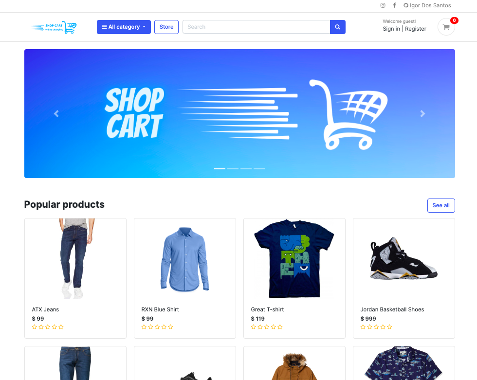

🛍️ Welcome to Shop Cart Web Application! 🛍️

Hey there! I'm Igor Dos Santos, and I'm thrilled to introduce you to Shop Cart – the ultimate online shopping experience designed with love and care! 🎉

### 🌟 What is Shop Cart? 🌟

Shop Cart is an innovative and secure e-commerce platform that aims to revolutionize the way you shop online. It's built with cutting-edge technologies and modern design to provide you with an immersive, fast, and enjoyable shopping journey. 🚀

### 🛒 Key Features & Highlights 🛒

- **User-Friendly Interface**: Our sleek and intuitive interface lets you browse through an extensive collection of products with ease. Finding your favorite items has never been more delightful! 😍
- **Smart Search**: Shop Cart's intelligent system helps you discover exciting new items tailored just for you by searching keywords and filtering through desired items. 🎁
- **Secure Payment Gateway**: Rest easy knowing that your payment information is fully protected with state-of-the-art encryption and secure authentication protocols with payments processed through PayPal. Your data's safety is our top priority. 🔒
- **Responsive Design**: Whether you're shopping from your desktop, tablet, or phone, Shop Cart adapts seamlessly to provide you with a flawless shopping experience, no matter the device. 📱
- **Real-Time Order Tracking**: Stay in the loop with live updates on your order status by email. You'll never have to wonder when your eagerly awaited package will arrive! 🚚

### 🎆 Explore the App 🎆

#### Home Page



As you land on Shop Cart's home page, you're greeted with a stunning carousel displaying brand images, setting the mood for a delightful shopping experience. 🌠 The top navigation bar provides easy access to various sections, including the "Home," "Store," "Register," and "Login" pages.

#### Store Page


The heart of Shop Cart lies in the Store Page, where a plethora of products awaits you. The smart search bar empowers you to find exactly what you desire in a matter of seconds. 😎 You can also filter products by category to quickly narrow down your search.

#### Product Overview


Clicking on a product takes you to the Product Overview page, where you can explore detailed information about the item, including its name, price, and product image. Here, users who bought the product and are logged in can leave ratings with up to 5 stars, including half-star selections, providing valuable insights for other shoppers. 🌟

#### User Registration and Sign-In


To unlock the full potential of Shop Cart, you'll want to create an account. The Register Page makes the process a breeze, with fields for your first name, last name, email address, phone number, password, and a password confirmation for added security. Once registered, you can access your dashboard and enjoy personalized shopping features. 🎉


For returning customers, the Login Page is the gateway to their personalized dashboard. Simply input your registered email and password to access your account, where you can view your orders and edit your profile details. 🔒


#### Dashboard


Welcome to your personalized dashboard! Here, you have full control over your shopping experience with Shop Cart. Let's explore the different sections and functionalities available to you:

#### Profile Management


Your profile is where you can view and edit your personal information. Update your name, email address, phone number, and even change your password to keep your account secure. We value your privacy and have implemented robust security measures to protect your data.

#### View Order History


Curious about your past purchases? The "Order History" section displays a comprehensive list of all your previous orders. You can view the order details, including the date, order number, and total amount spent. Stay organized and keep track of your shopping history effortlessly.


### 🚀 Getting Started 🚀

Ready to dive into the Shop Cart universe? Fantastic! Follow these simple steps to embark on your shopping adventure:

1. **Clone the Repository**: Grab the latest version of Shop Cart by running this command in your terminal:
   ```
   git clone https://github.com/Igor-dos-santos/ShopCart.git
   ```

2. **Install Dependencies**: Hop into the project directory and install the necessary dependencies:
   ```
   cd ShopCart
   npm install
   ```

3. **Launch the App**: It's showtime! Start the server and unleash Shop Cart:
   ```
   npm start
   ```

4. **Time to Shop!**: Now, open your web browser and head to [http://localhost:3000](http://localhost:3000). Embrace the joy of shopping with Shop Cart! 🎈

### 🛠️ Testing and Quality Assurance 🛠️

As the sole member of Shop Cart, I am dedicated to ensuring its stability and performance. I've implemented comprehensive testing suites to identify and fix potential issues. To run these tests and keep the app in top shape, I use the following command:
```
npm test
```

### 🛡️ Security and Privacy 🛡️

I know how crucial your personal information is, and I've taken every measure to safeguard it. Shop Cart utilizes state-of-the-art security protocols, robust encryption, and rigorous vulnerability testing to keep your data protected. Should you ever come across any security concerns, please let me know immediately through our [Security Bug Report Form](link

-to-report-form). Your safety is paramount to me! 🔐

### 📝 License and Legal Stuff 📝

Shop Cart is licensed under the [MIT License]([link-to-license-file](https://github.com/Igor-dos-santos/ShopCart/blob/second/LICENSE)). Feel free to check it out to understand your rights and the software's usage terms.

### 📧 Reach Out to Me 📧

If you have any questions, suggestions, or simply want to say hi, don't hesitate to reach out to me at [a2sigor@gmail.com](mailto:a2sigor@gmail.com). I'd love to hear from you and to assist you on your shopping journey! 💌

### 🙏 Acknowledgments 🙏

I want to express my gratitude to NCI that helped me throughout my education. Shop Cart wouldn't be possible without your amazing support and contributions! 🤗

🎉 Thank you for joining this incredible shopping adventure with Shop Cart! Happy Shopping, and may you discover endless treasures and delightful experiences! 🎉
